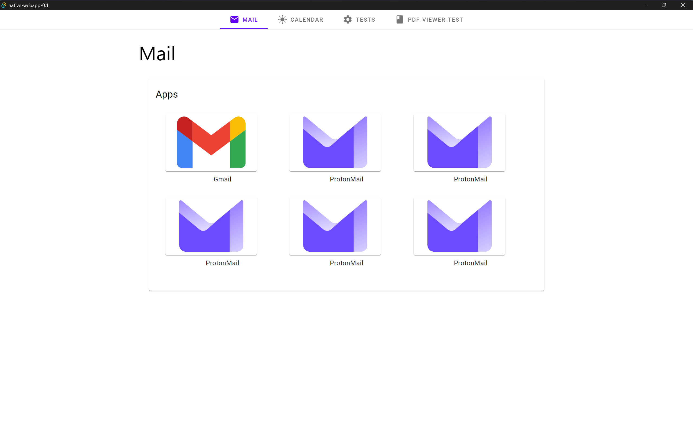
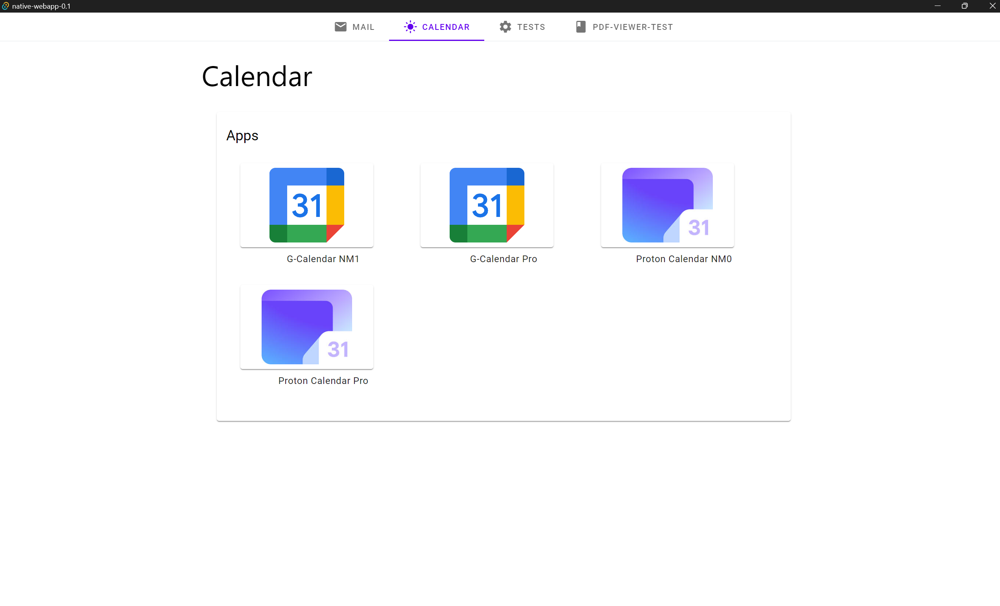
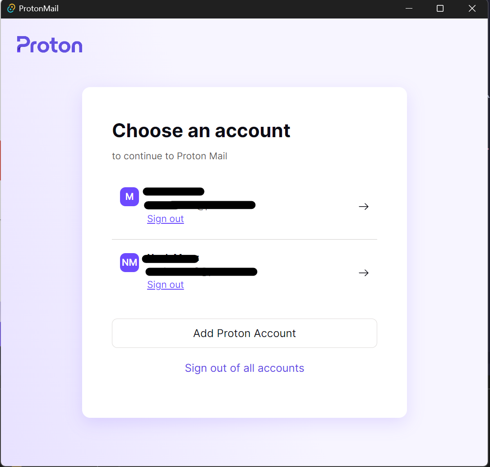

# Native WebApps

# Description 

Proof of Concept for Shortcut WebApp launching regularly used website in a [tauri](https://tauri.app) (Rust WebView) desktop application.

## Images






## Developing

Install [tauri](https://tauri.app)

Install dependencies with `npm install` (or `pnpm install` or `yarn` / `bun`), start a development server:


```bash
cargo tauri dev

# use --host to expose
cargo tauri dev --host
```
